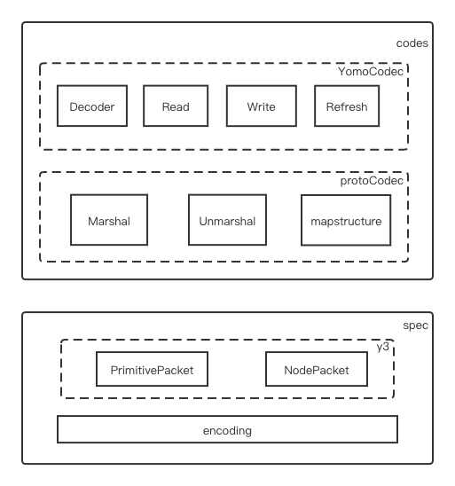

> 📚 VERSION: draft-02
>
> ⛳️ STATE: WIP
>
> 🇨🇳 [简体中文](README_CN.md)  🇬🇧 [English](https://github.com/yomorun/yomo-codec-golang/blob/master/README.md)

# Y3
[](https://app.fossa.com/projects/git%2Bgithub.com%2Fyomorun%2Fyomo-codec-golang?ref=badge_shield)


Golang implementation of [YoMo Codec](https://github.com/yomorun/yomo-codec)

## 目标

[Yomo-codec-golang](https://github.com/yomorun/yomo-codec-golang) 是通过golang语言实现[YoMo Codec](https://github.com/yomorun/yomo-codec)的[SPEC](https://github.com/yomorun/yomo-codec/blob/draft-01/SPEC.md)描述 ；提供对`TLV结构`及基础数据类型进行编解码的能力，并且为[YoMo](https://github.com/yomorun/yomo)提供支持其消息处理的编解码工具。你可以为其扩展出更多数据类型的处理，甚至可以扩展并应用到其它需要编解码的框架中。

## 结构


逻辑结构上主要分为两部分：实现[SPEC](https://github.com/yomorun/yomo-codec/blob/draft-01/SPEC.md)描述的基础编解码能力；在spec功能基础上为[YoMo](https://github.com/yomorun/yomo)等外部框架提供的扩展能力。

### spec

实现了[SPEC](https://github.com/yomorun/yomo-codec/blob/draft-01/SPEC.md)描述的消息结构及基础数据类型的编解码能力

* encoding 提供对[Pvarint](https://github.com/yomorun/yomo-codec/blob/draft-01/SPEC.md#pvarint)等基础类型的编码和解码能力，目前支持的基础数据类型：
  * PVarInt32
  * PVarUInt32
  * PVarInt64
  * PVarUInt64
  * VarFloat32
  * VarFloat64
* basePacket 派生出PrimitivePacket和NodePacket两种类型，并为其提供便捷的数据包编解码工具。
  * PrimitivePacket：定义了值类型的节点，是Codec中的最小单位，以`TLV结构`进行数据描述。
  * NodePacket：以`TLV结构`进行数据描述, 是用户定义类型，并支持类型的数组形式。

### codes

在spec的基础上提供面向应用的扩展能力，分为原始proto和YoMo两层扩展，以便更加弹性的支持不同类型的框架集成。

* protoCodec：实现了序列化和反序列化的接口方法，支持基础数据类型及其数组、结构体类型；为以此为基础构建特定框架适配的编解码接口工具提供必要的封装和能力，不需重复开发。

  ```go 
  type protoCodec interface {
  	Marshal(v interface{}) ([]byte, error)
  	Unmarshal(data []byte, v *interface{}) error
  }
  ```

  * Marshal：提供序列化能力

  * Unmarshal：提供反序化能力

  * mapstructure：为protoCodec接口提供对结构体的编解码能力，并在定义struct时通过"yomo"标签描述其编解码的行为(key)：

    ```go 
    type Example struct {
    	Id   int32  `yomo:"0x22"`
    	Name string `yomo:"0x23"`
    }
    ```
  
* YomoCodec：在protoCodec的基础上封装了对[YoMo](https://github.com/yomorun/yomo)框架的支持接口，该接口特定于框架的特定需求(如合并模式: *解析--监听--存储--读取--处理--合并--写入*)，针对于其它框架或者[YoMo](https://github.com/yomorun/yomo)框架不同版本的需要，则可以自定义开发不同的支持接口，以满足实际应用的需求。

  ```go 
  type YomoCodec interface {
  	protoCodec
  	Decoder(buf []byte)
  	Read(mold interface{}) (interface{}, error)
  	Write(w io.Writer, T interface{}, mold interface{}) (int, error)
  	Refresh(w io.Writer) (int, error)
  }
  ```

  在YoMo中如何使用该YomoCodec接口？将会在例子一节中描述其伪代码。


## 例子

### 1. 与YoMo结合

YomoCodec接口是为满足[YoMo](https://github.com/yomorun/yomo)框架对消息进行处理的特定需要而定义，因为[YoMo](https://github.com/yomorun/yomo)框架是基于QUIC的流式传输而设计，在对消息进行订阅并处理的过程中需要经过：解析--监听--存储--读取--处理--合并--写入的过程，这些过程的逻辑处理将融入到YomoCodec接口的实现中，[YoMo](https://github.com/yomorun/yomo)框架需要在适当的时机调用这些接口方法，例如如下伪代码：

```go 
codec := codes.NewCodec(observe)
codec.Decoder(buf)
for {
	value, err = w.Codec.Read(mold)
  if err != nil {
    break
  }
	if value == nil {
		codec.Refresh(Writer)
	}
	result, _ := process(value)
	codec.Write(Writer, result, mold)
}
```

随着[YoMo](https://github.com/yomorun/yomo)框架对消息处理的变更，例如不需要在处理被监听的数据后与原数据进行合并了，这时需要对YomoCodec接口进行升级来为新的需求进行适配，但此时使用的protoCodec接口一般来说是不需要变动，可以继续使用，从而提高了扩展开发的便利性。

### 2.protoCodec的例子

protoCodec为面向应用提供了最基础的序列化和反序列化能力，是构建面向应用的更高级接口的基础，当我们需要构建满足自已需求的接口时可以使用protoCodec接口来做。

#### Marshal examples 1: 基础类型

```go
package main

import (
	"fmt"

	"github.com/yomorun/yomo-codec-golang/pkg/codes"
)

func main() {
	// "y-new" serialize to `0x79, 0x2d, 0x6e, 0x65, 0x77`
	str := "y-new"
	codec := codes.NewCodec("")
	buf, _ := codec.Marshal(str)
	fmt.Printf("buf=%#x\n", buf)
}
```

More examples in `/pkg/codes/marshal_test.go`

#### Marshal examples 2: 结构体

```go
package main

import (
	"fmt"

	"github.com/yomorun/yomo-codec-golang/pkg/codes"
)

func main() {
	example := &Example{Id: 1, Name: "y"}
	codec := codes.NewCodec("")
	buf, _ := codec.Marshal(example)
	fmt.Printf("buf=%#x\n", buf)
}

type Example struct {
	Id   int32  `yomo:"0x22"`
	Name string `yomo:"0x23"`
}
```

#### Unmarshal examples 1: 基础类型

```go
package main

import (
	"fmt"
	"reflect"

	"github.com/yomorun/yomo-codec-golang/pkg/codes"
)

func main() {
	// `0x01, 0x03, 0x23, 0x1, 0x79` deserialize to "y"
  // observe key 0x23
	data := []byte{0x01, 0x03, 0x23, 0x1, 0x79}
	codec := codes.NewCodec("0x23")
	var mold interface{} = ""
	_ = codec.Unmarshal(data, &mold)
	fmt.Printf("mold is %v, value=%v\n", reflect.TypeOf(mold).Kind(), mold)
}
```

More examples in `/pkg/codes/unmarshal_test.go`

#### Unmarshal examples 2: 结构体

```go
package main

import (
	"fmt"
	"reflect"

	"github.com/yomorun/yomo-codec-golang/pkg/codes"
)

func main() {
	data := []byte{0x81, 0x08, 0x90, 0x6, 0x22, 0x1, 0x1, 0x23, 0x1, 0x79}
	codec := codes.NewCodec("0x10")
	var mold interface{} = &Example{}
	_ = codec.Unmarshal(data, &mold)
	fmt.Printf("mold is %v, Id=%v, Name=%v\n", 
		reflect.TypeOf(mold).Kind(), mold.(*Example).Id, mold.(*Example).Name)
}

type Example struct {
	Id   int32  `yomo:"0x22"`
	Name string `yomo:"0x23"`
}
```

### 3. Y3的例子

y3包是对basePacket的两个扩展PrimitivePacket和NodePacket进行编解码的封装处理。

#### Encode examples

```go
package main

import (
	"fmt"
	y3 "github.com/yomorun/yomo-codec-golang"
)

func main() {
	// if we want to repesent `var obj = &foo{ID: -1, bar: &bar{Name: "C"}}` 
	// in YoMo-Codec:

	// 0x81 -> node
	var foo = y3.NewNodePacketEncoder(0x01)

	// 0x02 -> foo.ID=-11
	var yp1 = y3.NewPrimitivePacketEncoder(0x02)
	yp1.SetInt32Value(-1)
	foo.AddPrimitivePacket(yp1)

	// 0x83 -> &bar{}
	var bar = y3.NewNodePacketEncoder(0x03)

	// 0x04 -> bar.Name="C"
	var yp2 = y3.NewPrimitivePacketEncoder(0x04)
	yp2.SetStringValue("C")
	bar.AddPrimitivePacket(yp2)
	
	// -> foo.bar=&bar
	foo.AddNodePacket(bar)

	fmt.Printf("res=%#v", foo.Encode()) // res=[]byte{0x81, 0x08, 0x02, 0x01, 0x7F, 0x83, 0x03, 0x04, 0x01, 0x43}
}
```

#### Decode examples 1: decode a primitive packet

```go
package main

import (
	"fmt"

	y3 "github.com/yomorun/yomo-codec-golang"
)

func main() {
	fmt.Println(">> Parsing [0x0A, 0x02, 0x80, 0x7F], which like Key-Value format = 0x0A: 127")
	buf := []byte{0x0A, 0x02, 0x80, 0x7F}
	res, _, _, err := y3.DecodePrimitivePacket(buf)
	v1, err := res.ToUInt32()
	if err != nil {
		panic(err)
	}

	fmt.Printf("Tag Key=[%#X], Value=%v\n", res.SeqID(), v1)
}
```

#### Decode examples 2: decode a node packet

```go
package main

import (
	"fmt"
	y3 "github.com/yomorun/yomo-codec-golang"
)

func main() {
	fmt.Println(">> Parsing [0x84, 0x06, 0x0A, 0x01, 0x7F, 0x0B, 0x01, 0x43] EQUALS JSON= 0x84: { 0x0A: -1, 0x0B: 'C' }")
	buf := []byte{0x84, 0x06, 0x0A, 0x01, 0x7F, 0x0B, 0x01, 0x43}
	res, _, err := y3.DecodeNodePacket(buf)
	v1 := res.PrimitivePackets[0]

	p1, err := v1.ToInt32()
	if err != nil {
		panic(err)
	}
	fmt.Printf("Tag Key=[%#X.%#X], Value=%v\n", res.SeqID(), v1.SeqID(), p1)

	v2 := res.PrimitivePackets[1]

	p2, err := v2.ToUTF8String()
	if err != nil {
		panic(err)
	}

	fmt.Printf("Tag Key=[%#X.%#X], Value=%v\n", res.SeqID(), v2.SeqID(), p2)
}
```

More examples in `/examples/`

### 4.encoding的例子

encoding包中定义了基础类型的编解码方法，如果需要扩展支持更多的基础类型(如:uuid等)，则可以在这个包中增加方法。

#### examples

```go
package main

import (
	"fmt"
	"reflect"

	"github.com/yomorun/yomo-codec-golang/pkg/spec/encoding"
)

func main() {
	var value int32 = 127
	var bytes = []byte{0x80, 0x7F}

	// encode: 127 -> `0x80, 0x7F`
	var size = encoding.SizeOfPVarInt32(value)
	buffer := make([]byte, len(bytes))
	codec := encoding.VarCodec{Size: size}
	_ = codec.EncodePVarInt32(buffer, value)
	fmt.Printf("buffer=%#x\n", buffer)

	// decode: `0x80, 0x7F` -> 127
	var val int32
	codec = encoding.VarCodec{}
	_ = codec.DecodePVarInt32(bytes, &val)
	fmt.Printf("val is %v, val=%v\n", reflect.TypeOf(val).Kind(), val)
}
```

More examples in `/pkg/spec/encoding/pvarint_test.go|varfloat_test.go`

## 路线图

- [x] v0.1.0 - [SPEC](https://github.com/yomorun/yomo-codec/blob/draft-01/SPEC.md)描述的实现
  - [x] encoding: Int32/UInt32/Int64/UInt64/Float32/Float64
  - [x] PrimitivePacket: 
  - [x] NodePacket
- [x] v0.2.0 - protoCode/YomoCode
  - [x] 支持基础类型
  - [x] 支持基础类型的数组
  - [x] 支持[YoMo](https://github.com/yomorun/yomo)框架的集成(基础类型)
    - [x] 满足处理流程：解析--监听--存储--读取--处理--合并--写入
- [ ] v0.30 - protoCode/YomoCode增强
  - [ ] 支持结构体struct
  - [ ] 支持结构体的数组
- [ ] v0.4.0 - 支持[yomo-thermometer-plugin](https://github.com/10cella/yomo-thermometer-plugin)插件
  - [ ] 支持[]Thermometer{}的Mold形式
  - [ ] [YoMo](https://github.com/yomorun/yomo)框架的正式切换至[Yomo-codec-golang](https://github.com/yomorun/yomo-codec-golang)
- [ ] v0.5.0 - 性能压测及优化重构
- [ ] v0.6.0 - 支持UUID及Bool类型
  - [ ] encoding
  - [ ] PrimitivePacket
  - [ ] protoCode
- [ ] v0.7.0 - 支持[YoMo](https://github.com/yomorun/yomo)框架的新的解析需求
  - [ ] 满足处理流程：解析--监听--读取--处理--写入
  - [ ] 支持两种出理流程的切换
- [ ] v0.9.0 - 支持简单的控制指令和错误码
- [ ] v1.0.0 - 支持与QUIC-for-YoMo框架的集成
- [ ] 

## YoMo Codec

See [SPEC](https://github.com/yomorun/yomo-codec)

## Contributors

[//]: contributor-faces

<a href="https://github.com/figroc"></a>

[//]: contributor-faces

## License
[](https://app.fossa.com/projects/git%2Bgithub.com%2Fyomorun%2Fyomo-codec-golang?ref=badge_large)
